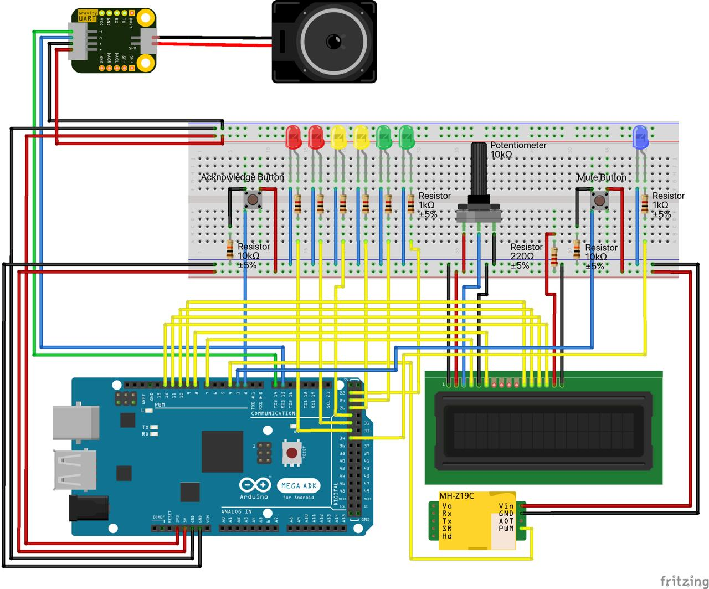

# Air Quality Meter

The **Air Quality Meter** is an Arduino-based project that monitors **CO2 levels** in the air and provides **visual**,
**textual**, and **audible feedback** to alert users when air quality drops.

## Table of Contents

- [Air Quality Meter](#air-quality-meter)
    - [Table of Contents](#table-of-contents)
    - [✨ Features](#-features)
    - [🚀 Getting Started](#-getting-started)
        - [1. Upload MP3 Files to the MP3 Module](#1-upload-mp3-files-to-the-mp3-module)
        - [2. Connect Hardware](#2-connect-hardware)
        - [3. Clone the Repository](#3-clone-the-repository)
        - [4. Open the Project](#4-open-the-project)
        - [5. Upload the Code](#5-upload-the-code)
        - [6. (Optional) Monitor Serial Output](#6-optional-monitor-serial-output)
    - [🧾 Configuring Logging](#-configuring-logging-platformioini)
    - [🎒 Hardware Requirements](#-hardware-requirements)
    - [💻 Software Requirements](#-software-requirements)
        - [Library Dependencies](#library-dependencies)
    - [🔌 Connections](#-connections)
        - [📈 Wiring Diagram](#-wiring-diagram)
        - [📌 Arduino Pin Connections Table](#-arduino-pin-connections-table)
        - [⚡ Power and Ground Connections Table](#-power-and-ground-connections-table)
        - [🔗 Other Component Connections Table](#-other-component-connections-table)
        - [💡 Notes and Recommendations](#-notes-and-recommendations)
        - [❗ Important Safety Note](#-important-safety-notes)
    - [🚀 Operational Flow](#-operational-flow)
        - [1. System Startup](#1-system-startup)
        - [2. CO2 Monitoring](#2-co2-monitoring)
        - [3. Audio Alert](#3-audio-alert)
    - [🔕 Acknowledge and Mute Button Functionality](#-acknowledge-and-mute-button-functionality)
        - [Acknowledge Button](#acknowledge-button)
        - [Mute Button](#mute-button)
    - [🚦 LED Indicator System](#-led-indicator-system)
        - [LED Patterns for Air Quality](#led-patterns-for-air-quality)
        - [Acknowledgement Indicator](#acknowledgement-indicator)
        - [Mute Indicator](#mute-indicator)
        - [⛔ Error Conditions](#-error-conditions)
        - [💡 Legend for LED Colors](#-legend-for-led-colors)
    - [📚 Standards and References](#-standards-and-references)
    - [🤝 Contribute](#-contribute)
    - [📝 License](#-license)

## ✨ Features

- ✅ **CO2 Measurement**: Using the **MH-Z19B sensor**, the device continuously measures CO2 levels in ppm (parts per
  million).
- ✅ **LCD**: The real-time CO2 levels and air-quality messages are displayed on a **16x2 LCD**.
- ✅ **LED Indicators**:
    - **Green LEDs**: High air quality.
    - **Yellow LEDs**: Moderate air quality.
    - **Red LEDs**: Poor air quality.
    - **Blue LED**: Indicates if the system is muted.
- ✅ **Audio Alerts**: A **pre-recorded voice warning** is activated when CO2 levels stay above a dangerous threshold for
  too long.
- ✅ **Acknowledgment Button**: A manual button to acknowledge the alert, reset the warning system, and temporarily stop
  audio warnings.
- ✅ **Mute Button**: A manual button to toggle the system's mute state, disabling or enabling audio alerts.

## 🚀 Getting Started

### 1. Upload MP3 Files to the MP3 Module

The Gravity UART MP3 Voice Module requires pre-recorded MP3 files for audio alerts. Two MP3 files are provided in the
audio/ directory of this repo:

- `001.mp3`: "CO2 Wert zu hoch, bitte Fenster öffnen!" (German for: "CO2 level too high, please open the window!")
- `002.mp3`: "Die Luftqualität ist schlecht, bitte Fenster öffnen!" (German for: "Air quality is poor, please open
  a window!")

If you prefer to use your own MP3 file, make sure it meets all requirements (see
[wiki DFRobot](https://wiki.dfrobot.com/Voice_Module_SKU__DFR0534)).

#### Upload Instructions:

##### 1. Prepare the MP3 Module:

- Ensure the MP3 module is connected to your computer using a compatible USB cable.

- It should appear as a removable drive.

##### 2. Copy MP3 File:

- If there are already sample files on your module, delete them first (or at least make sure that no file with the name
  001.mp3 pre-exists on the module)

- Copy an MP3 file with the audio warning for poor air quality to the root directory of the MP3 module.

  *You can use one of the provided files from the audio/ directory of this repo if you want.*

  **Important**: The file used must be named exactly `001.mp3` on the MP3 module for the system to recognize it
  correctly. If you use your own MP3 file, make also sure it meets all requirements (see
  [wiki DFRobot](https://wiki.dfrobot.com/Voice_Module_SKU__DFR0534)).

##### 3. Eject the Module:

- Safely eject the MP3 module from your computer to prevent data corruption.

The MP3 file is now uploaded and ready to be used by the Air Quality Meter.

### 2. Connect Hardware

Connect all hardware components according to the 🔌 [Connections](#-connections) section and check the
📈 [wiring diagram](#-wiring-diagram). Ensure to follow the safety guidelines outlined in the
💡 [Notes and Recommendations](#-notes-and-recommendations) section, including the
❗ [Important Safety Note](#-important-safety-notes).

### 3. Clone the Repository

```shell
git clone https://github.com/air-quality-meter/air-quality-meter.git
cd air-quality-meter
```

### 4. Open the Project

Open the project in your preferred IDE (with PlatformIO plugin installed).

### 5. Upload the Code

Connect your Arduino Mega 2560 to the PC.
Upload the code using PlatformIO:

```shell
pio run --target upload
```

### 6. (Optional) Monitor Serial Output

Launch the Serial Monitor for feedback:

```shell
pio device monitor
```

## 🧾 Configuring Logging (platformio.ini)

You can control the logging output from the Air Quality Meter by modifying the `platformio.ini` project
configuration file. The `build_flags` option allows you to define preprocessor directives that affect the compilation
process.

**To Disable Logging:**

1. Open the `platformio.ini` file in your project's root directory.
2. Find the `build_flags = `-line:

   ```ini
   build_flags = -Iinclude
   ```
3. Modify that line to include the `-DDISABLE_LOGGING` flag:

   ```ini
   build_flags = -Iinclude -DDISABLE_LOGGING
   ```
4. Save the `platformio.ini` file.
5. Clean and rebuild the project in PlatformIO for the changes to take effect.

**To Enable Logging (Default):**

1. Open the `platformio.ini` file in your project's root directory.
2. Find the `build_flags = `-line:

   ```ini
   build_flags = -Iinclude -DDISABLE_LOGGING
   ```

3. Modify that line to not include the `-DDISABLE_LOGGING` flag anymore:

   ```ini
   build_flags = -Iinclude
   ```

4. Save the `platformio.ini` file.
5. Clean and rebuild the project in PlatformIO for the changes to take effect.

**Modify Log Levels**
When logging is enabled, you can adjust the verbosity using the `LOG_LEVEL` variable in `src/main.cpp`. The available
levels are (from most to least verbose):

- `LOG_LEVEL_VERBOSE`
- `LOG_LEVEL_TRACE`
- `LOG_LEVEL_NOTICE`
- `LOG_LEVEL_WARNING`
- `LOG_LEVEL_ERROR`
- `LOG_LEVEL_SILENT`

1. Modify the following line in `src/main.cpp` accordingly:

    ```c++
    constexpr uint8_t LOG_LEVEL = LOG_LEVEL_VERBOSE;
    ```

2. Clean and rebuild the project in PlatformIO.

## 🎒 Hardware Requirements

| **Component**                           | **Quantity** | **Description**                                            |
|:----------------------------------------|:------------:|:-----------------------------------------------------------|
| 🧮 **Arduino Mega 2560**                |      1       | Main microcontroller for running the system.               |
| 💨 **MH-Z19B CO2 Sensor Module**        |      1       | CO2 sensor providing ppm measurements.                     |
| 📟 **LCD1602 Display Module**           |      1       | 16x2 LCD display for showing CO2 levels and user messages. |
| 🎵 **Gravity UART MP3 Voice Module**    |      1       | Audio playback for voice alerts.                           |
| 🔊 **3W 8Ω Speaker in Housing**         |      1       | Small speaker to output the alert sounds.                  |
| 🟢 **LED (Green)**                      |      2       | LED for visual output                                      |
| 🟡 **LED (Yellow)**                     |      2       | LED for visual output                                      |
| 🔴 **LED (Red)**                        |      2       | LED for visual output                                      |
| 🔵 **LED (Blue)**                       |      1       | LED for visual output                                      |
| 🔘 **Push Buttons**                     |      2       | Manual buttons to acknowledge alarms or toggle mute state. |
| 🎚️ **10K Potentiometer (B103)**        |      1       | Brightness adjustment for the LCD1602 display.             |
| 🧱 **1KΩ Resistor**                     |      7       | For safely operating LEDs.                                 |
| 🧱 **10KΩ Resistor**                    |      2       | For safely operating Push buttons.                         |
| 🧱 **220Ω Resistor**                    |      1       | For safely operating the display module.                   |
| 🧷 **Jumper Wires +** 🍞 **Breadboard** |  As Needed   | For wiring all components on a prototyping circuit.        |

## 💻 Software Requirements

| **Tool**       | **Version** | **Notes**                         |
|----------------|:-----------:|-----------------------------------|
| **PlatformIO** |   Latest    | E.g. to use with VSCode or CLion. |

This is the recommended IDE (with plugins for VSCode or CLion) for building and uploading the code to
the Arduino. Using the latest version is always recommended.

### Library Dependencies

These are the external libraries that the project relies on.
Install these libraries (dependencies) in your PlatformIO project (should happen automatically during the build
process):

```ini
lib_deps =
    featherfly/SoftwareSerial@^1.0
    arduino-libraries/LiquidCrystal@^1.0.7
    https://github.com/thijse/Arduino-Log.git
    tobiasschuerg/MH-Z CO2 Sensors@^1.6.0
```

**Explanation:**

- `featherfly/SoftwareSerial@^1.0`: Provides software serial communication (used for the MP3 module).
- `arduino-libraries/LiquidCrystal@^1.0.7`: Standard library for controlling the LCD1602 display.
- `https://github.com/thijse/Arduino-Log.git`: A logging library for debugging and monitoring the system. Use the GitHub
  repo here since the repo distributed by PlatformIO is not up to date.
- `tobiasschuerg/MH-Z CO2 Sensors@^1.6.0`: Library specifically designed for interfacing with MH-Z series CO2 sensors,
  including the MH-Z19B.

**Note**

The `lib_deps` section in the `platformio.ini` file automatically handles the installation of these dependencies when
you build the project in PlatformIO.

## 🔌 Connections

## 📈 Wiring Diagram



### 📌 Arduino Pin Connections Table

This table shows all the **pins used** in the project, including their connected components. Each pin plays a
specific role in enabling the functionality of the air quality meter.

| **Arduino Pin** | **Component**                        | **Connection** | **Notes**                                                     |
|:----------------|:-------------------------------------|:---------------|:--------------------------------------------------------------|
| `2 (INT0)`      | 🔘 **Acknowledge Button**            | Pin 1          | Button Pin 1 connects to Button Pin 3 when pressed.           |
| `3 (INT1)`      | 🔘 **Mute Button**                   | Pin 1          | Button Pin 1 connects to Button Pin 3 when pressed.           |
| `4`             | 💨 **CO2 Sensor (MH-Z19B)** (PWM)    | PWM            | Connected to the sensor's PWM pin.                            |
| `7`             | 📟 **LCD1602 Display** (RS)          | RS             | Register Select for the LCD Display.                          |
| `8`             | 📟 **LCD1602 Display** (E)           | E              | Enable Pin for the LCD Display.                               |
| `9`             | 📟 **LCD1602 Display** (D4)          | D4             | Data line 4 for the LCD Display.                              |
| `10`            | 📟 **LCD1602 Display** (D5)          | D5             | Data line 5 for the LCD Display.                              |
| `11`            | 📟 **LCD1602 Display** (D6)          | D6             | Data line 6 for the LCD Display.                              |
| `12`            | 📟 **LCD1602 Display** (D7)          | D7             | Data line 7 for the LCD Display.                              |
| `14`            | 🎵 **Gravity UART MP3 Voice Module** | T              | MP3 Module [T]ransmit to Arduino 14 Receive (SoftwareSerial). |
| `15`            | 🎵 **Gravity UART MP3 Voice Module** | R              | MP3 Module [R]eceive to Arduino 15 Transmit (SoftwareSerial). |
| `22`            | 🟢 **Green LED 1**                   | Anode (+)      | Connected through 🧱 1KΩ resistor                             |
| `24`            | 🟢 **Green LED 2**                   | Anode (+)      | Connected through 🧱 1KΩ resistor                             |
| `26`            | 🟡 **Yellow LED 1**                  | Anode (+)      | Connected through 🧱 1KΩ resistor                             |
| `28`            | 🟡 **Yellow LED 2**                  | Anode (+)      | Connected through 🧱 1KΩ resistor                             |
| `30`            | 🔴 **Red LED 1**                     | Anode (+)      | Connected through 🧱 1KΩ resistor                             |
| `32`            | 🔴 **Red LED 2**                     | Anode (+)      | Connected through 🧱 1KΩ resistor                             |
| `34`            | 🔵 **Blue LED**                      | Anode (+)      | Connected through 🧱 1KΩ resistor                             |

### ⚡ Power and Ground Connections Table

This table provides a detailed overview of the **power and ground connections** for the components used in the project.
Proper wiring ensures stability and optimal performance of the system.

| **Arduino Pin**  | **Component**                         | **Connection**  | **Notes**                                                                            |
|:-----------------|:--------------------------------------|:----------------|:-------------------------------------------------------------------------------------|
| `5V`             | 💨  **CO2 Sensor (MH-Z19B)**          | Vin             | Provides operating power to the CO2 sensor.                                          |
| `GND`            | 💨  **CO2 Sensor (MH-Z19B)**          | GND             | Ground connection for the CO2 sensor.                                                |
| `GND`            | 📟  **LCD1602 Display**               | VSS (Ground)    | Ground pin for the LCD module.                                                       |
| `5V`             | 📟  **LCD1602 Display**               | VDD (Power)     | Supply power pin for the LCD module.                                                 |
| `GND`            | 📟  **LCD1602 Display**               | RW (Read/Write) | Set to GND for write-only operation.                                                 |
| `5V`             | 📟  **LCD1602 Backlight**             | A (Anode +)     | Backlight power through a 🧱 220Ω resistor.                                          |
| `GND`            | 📟  **LCD1602 Backlight**             | K (Cathode -)   | Ground connection for the LCD backlight.                                             |
| `GND`            | 🔘 **Acknowledge Button**             | Pin 2           | Connected to GND through a 🧱 10KΩ pull-down resistor.                               |
| `5V`             | 🔘 **Acknowledge Button**             | Pin 3           | Pin 3 is connected to 5V (internally connected to Pin 1 when the button is pressed). |
| `GND`            | 🔘 **Mute Button**                    | Pin 2           | Connected to GND through a 🧱 10KΩ pull-down resistor.                               |
| `5V`             | 🔘 **Mute Button**                    | Pin 3           | Pin 3 is connected to 5V (internally connected to Pin 1 when the button is pressed). |
| `GND`            | 🎚️ **10K Potentiometer (B103)**      | Outer Pin 1     | First pin connected to ground.                                                       |
| `5V`             | 🎚️ **10K Potentiometer (B103)**      | Outer Pin 2     | Second pin connected to power.                                                       |
| `GND`            | 🟢  **Green LED 1**                   | Cathode (-)     | Ground for the first green LED.                                                      |
| `GND`            | 🟢  **Green LED 2**                   | Cathode (-)     | Ground for the second green LED.                                                     |
| `GND`            | 🟡  **Yellow LED 1**                  | Cathode (-)     | Ground for the first yellow LED.                                                     |
| `GND`            | 🟡  **Yellow LED 2**                  | Cathode (-)     | Ground for the second yellow LED.                                                    |
| `GND`            | 🔴  **Red LED 1**                     | Cathode (-)     | Ground for the first red LED.                                                        |
| `GND`            | 🔴  **Red LED 2**                     | Cathode (-)     | Ground for the second red LED.                                                       |
| `GND`            | 🔵 **Blue LED**                       | Cathode (-)     | Ground for the blue LED.                                                             |
| `3.3V`           | 🎵  **Gravity UART MP3 Voice Module** | + (Power)       | Operates with 3.3V power.                                                            |
| `GND` (separate) | 🎵  **Gravity UART MP3 Voice Module** | - (Ground)      | Use a separate ground pin for reliability.                                           |

### 🔗 Other Component Connections Table

These components require additional connections between one another for proper functionality:

| **Component 1**                | **Connection** | **Component 2**                 | **Connection** | **Notes**                        |
|:-------------------------------|:---------------|:--------------------------------|:---------------|:---------------------------------|
| 🎚️ **10K Potentiometer**      | Middle Pin     | 📟 **LCD1602 Display**          | VO             | Adjusts the contrast of the LCD. |
| 🎵 **Gravity UART MP3 Module** | SPK            | 🔊 **3W 8Ω Speaker in Housing** | SPK            | Provides audio output.           |

### 💡 Notes and Recommendations

* **Backlight Resistor**: Always use a 🧱 **220Ω resistor** for the LCD backlight (between pin `A` and `5V`) to control
  current and extend its lifespan.
* **LED Resistors**: Add 🧱 **1kΩ resistors** in series with each LED (Green, Yellow, Red, Blue) to prevent damage to the
  LED and the Arduino pins.
* **Button Resistors**: Use 🧱 **10kΩ pull-down resistors** for both the acknowledge and mute push buttons to avoid
  floating states and unreliable behavior.
* **Understand the Connections**: Before making any connections, take the time to understand the purpose of each pin and
  the direction of the current flow. This will help you troubleshoot any issues and make modifications if needed.
* **Secure Connections**: Ensure that all jumper wires are securely connected to the breadboard and/or components.
  Loose connections can cause intermittent problems.
* **Power Supply**: Use a stable power supply for the Arduino. A reliable power source is crucial for the proper
  functioning of the CO2 sensor and other components.
* **MP3 Module Power**: The Gravity UART MP3 Voice Module requires 3.3V power. Ensure you are connecting it to the 3.3V
  pin on the Arduino, not the 5V pin.
* **MP3 Module Ground**: Connect the MP3 module's ground to a separate GND pin on the Arduino.
* **CO2 Sensor Preheating**: The MH-Z19B CO2 sensor requires a long preheating period (about 3 Minutes).
* **Code Customization**: If you modify the code, be mindful of the pin assignments defined in `pin_configuration.h`.
  Ensure they match your physical wiring.
* **Safety First**: Always disconnect the power supply before making any changes to the wiring.

### ❗ Important Safety Notes

Before powering on your Air Quality Meter, please take the following precautions:

1. 🔍 **Double check Wiring:** Carefully compare your physical wiring against the provided
   📈 [wiring diagram](#-wiring-diagram). Ensure that each component is connected to the correct pins on the Arduino
   and other modules.
2. 🧠 **Understand the Connections:** Take a moment to understand *why* each connection is made. Think about the flow of
   power and signals. Does it make sense to you based on the component's function? If something seems unclear, do
   further research or ask for assistance in a relevant forum.
3. ❗ **Disclaimer:** While we have made every effort to ensure the accuracy of the wiring information provided, we
   cannot guarantee that it is error-free or suitable for all possible configurations. We **do not accept liability**
   for any damage to devices, components, or property, **nor for any harm or injuries that may occur** as a result of
   following these instructions. Proceed with caution and at your own risk.

**Your safety and the proper functioning of your project are your responsibility!**

🤝 **Found an Error? Help Us Improve!**

If you find any errors in the description, wiring diagram, code, or any other part of this project, please
**let us know**! Your feedback is valuable and will help us improve the project for everyone. You can report errors
by [opening an issue on GitHub](https://github.com/air-quality-meter/air-quality-meter/issues) . We appreciate your
contribution!

## 🚀 Operational Flow

### 1. System Startup

* The system initializes all modules (display, LEDs, CO2 sensor, audio, buttons).
* The CO2 sensor will preheat for approximately 3 minutes according to its specifications.
  The Display shows a progress bar during preheating.

### 2. CO2 Monitoring

* Real-time CO2 levels (in ppm) are displayed on the LCD, along with a descriptive air quality message (e.g., "High air
  quality," "Poor air quality").
* LEDs light up based on the current **air quality range** (see [🚦 LED Indicator System](#-led-indicator-system)).

### 3. Audio Alert

* If the CO2 level remains `>1400 ppm` (Poor indoor air quality) for >60 seconds, the voice module issues an audio
  warning to ventilate the room.
* The system will continue issuing further audio warnings until either
    * the acknowledge button is pressed (wait for another 60 seconds)
    * the CO2 level falls below 1400 ppm again
    * five consecutive warnings are issued (wait for another 60 seconds)
    * the mute button is pressed.

## 🔕 Acknowledge and Mute Button Functionality

### Acknowledge Button

* **Purpose:** The acknowledge button is used to temporarily stop audio warnings (for 60 seconds). This allows you to
  open windows in the meantime.
* **Action:** When pressed, the button performs the following actions:
    * Resets the warning counter.
    * Resets the time, when the CO2 level was lastly below the threshold, to the current time.
    * Temporarily stops playing audio warning.
    * Provides visual feedback through a specific LED sequence (
      see [Acknowledgement Indicator](#acknowledgement-indicator)).

### Mute Button

* **Purpose:** The mute button is used to enable or disable all audio warnings.
* **Action:** When pressed, the button toggles the system's mute state.
    * If the system is currently **not muted**, pressing the button will **mute** it.
    * If the system is currently **muted**, pressing the button will **unmute** it.
    * The blue LED indicates the current mute state (on = muted, off = not muted) (
      see [Mute Indicator](#mute-indicator))

## 🚦 LED Indicator System

The **Air Quality Meter** uses seven LEDs to visually represent the current air quality, mute state or error state. The
LEDs are as follows:

* **Green LED 1** (G1) and **Green LED 2** (G2)
* **Yellow LED 1** (Y1) and **Yellow LED 2** (Y2)
* **Red LED 1** (R1) and **Red LED 2** (R2)
* **Blue LED** (B1)

### LED Patterns for Air Quality

Each LED pattern signifies a specific air quality level. Below is the list of the possible patterns:

| G1 | G2 | Y1 | Y2 | R1 | R2 | **Pattern Name**                   | **Range**       | **DIN EN 13779 level** |
|:---|:---|:---|:---|:---|:---|:-----------------------------------|:----------------|:-----------------------|
| 🟢 | 🟢 | ⚫️ | ⚫️ | ⚫️ | ⚫️ | **High indoor air quality**        | `400-800 ppm`   | IDA 1                  |
| ⚫️ | 🟢 | 🟡 | ⚫️ | ⚫️ | ⚫️ | **Medium indoor air quality**      | `800-1100 ppm`  | IDA 2                  |
| ⚫️ | ⚫️ | 🟡 | 🟡 | ⚫️ | ⚫️ | **Moderate indoor air quality I**  | `1100-1300 ppm` | IDA 3                  |
| ⚫️ | ⚫️ | ⚫️ | 🟡 | 🔴 | ⚫️ | **Moderate indoor air quality II** | `1300-1400 ppm` | IDA 3                  |
| ⚫️ | ⚫️ | ⚫️ | ⚫️ | 🔴 | 🔴 | **Poor indoor air quality**        | `>1400 ppm`     | IDA 4                  |

### Acknowledgement Indicator

When the acknowledge button is pressed, the LEDs will display the following specific sequence to indicate that the
button press has been registered (see
also [🔕 Acknowledge and Mute Button Functionality](#-acknowledge-and-mute-button-functionality)):

| G1 | G2 | Y1 | Y2 | R1 | R2 |
|:---|:---|:---|:---|:---|:---|
| 🟢 | ⚫️ | ⚫️ | ⚫️ | ⚫️ | ⚫️ |
| ⚫️ | 🟢 | ⚫️ | ⚫️ | ⚫️ | ⚫️ |
| ⚫️ | ⚫️ | 🟡 | ⚫️ | ⚫️ | ⚫️ |
| ⚫️ | ⚫️ | ⚫️ | 🟡 | ⚫️ | ⚫️ |
| ⚫️ | ⚫️ | ⚫️ | ⚫️ | 🔴 | ⚫️ |
| ⚫️ | ⚫️ | ⚫️ | ⚫️ | ⚫️ | 🔴 |

This sequence runs once, and then the LEDs revert to displaying the current air quality status.

### Mute Indicator

* **Blue LED** (B1): Indicates if the system's audio alerts are muted.

| B1 | **System Mute State** |
|:---|:----------------------|
| 🔵 | System is Muted       |
| ⚫️ | System is Not Muted   |

### ⛔ Error Conditions

If the sensor encounters a problem, specific LED patterns indicate the type of error:

| G1 | G2 | Y1 | Y2 | R1 | R2 | **Error Pattern Name**    | **Description**                                                              |
|:---|:---|:---|:---|:---|:---|:--------------------------|:-----------------------------------------------------------------------------|
| 🟢 | 🟢 | 🟡 | 🟡 | 🔴 | 🔴 | **Measurement Not Valid** | The system is unable to retrieve a valid measurement from the sensor module. |

### 💡 Legend for LED Colors

| **Color** | **Meaning** |
|:----------|:------------|
| 🟢🟡🔴🔵  | LED is ON   |
| ⚫️        | LED is OFF  |

This classification ensures users can quickly interpret the air quality status, recognize the mute state or errors.

## 📚 Standards and References

This project utilizes data and specifications from the following sources:

* **Air Quality Levels:** The air quality levels and their corresponding CO2 concentration ranges used in this project
  are based on the **DIN EN 13779** standard, as described in the following document:

    * **GUIDELINES FOR INDOOR AIR HYGIENE IN SCHOOL BUILDINGS**. Published by the German Federal Environment Agency
      (UBA), 2008. [Link to PDF](https://www.umweltbundesamt.de/sites/default/files/medien/publikation/long/4113.pdf)

      Specifically, the classifications are derived from **Table 3 on page 38** of the document, which outlines the
      categories of indoor air quality (IDA 1 to IDA 4) and their associated CO2 concentration ranges.

* **CO2 Sensor:** This project uses the **MH-Z19B CO2 Sensor** from Winsen. The sensor's technical specifications and
  operating characteristics can be found in the following datasheet:

    * **Infrared CO2 Sensor Module (Model: MH-Z19B). User's Manual**.
      Winsen, 2019. [Link to PDF](https://www.winsen-sensor.com/d/files/MH-Z19B.pdf)

## 🤝 Contribute

Want to enhance this project? Contributions are welcome! We appreciate your help in making the Air Quality Meter better.
Here's how you can contribute:

* **Report Bugs:** If you find any bugs or unexpected behavior,
  please [open an issue on GitHub](https://github.com/air-quality-meter/air-quality-meter/issues) and describe the
  problem in detail. Include steps to reproduce the bug, error messages, logs, and any relevant information about your
  setup.
* **Suggest Features:** Have an idea for a new feature or
  improvement? [Open an issue on GitHub](https://github.com/air-quality-meter/air-quality-meter/issues) and describe
  your suggestion. We're always open to new ideas!
* **Submit Pull Requests:** If you've fixed a bug or implemented a new feature, you can submit a pull request.
  Please ensure your code follows the project's coding style and includes appropriate comments (Doxygen style
  preferred).
* **Improve Documentation:** If you find any errors or omissions in the documentation, or if you can make it clearer or
  more comprehensive, please submit a pull request with your proposed changes.

## 📝 License

This project is licensed under the **MIT License**. See the [LICENSE](LICENSE) file for details. Feel free to use,
modify, and distribute this project according to the terms of the MIT License.